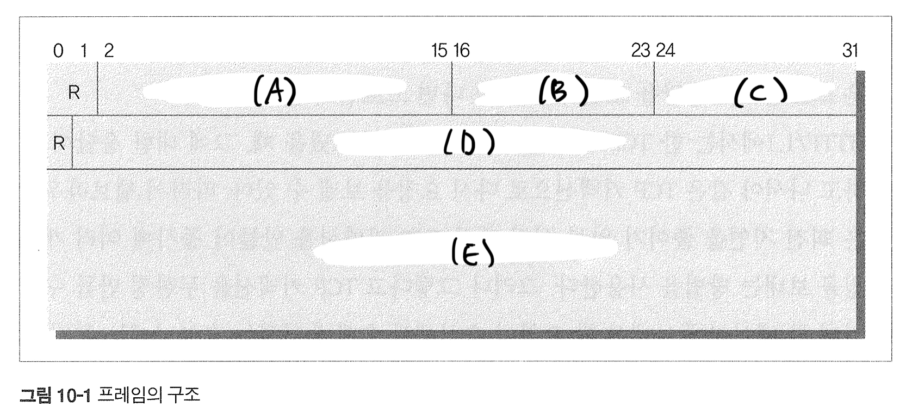

# 10장 HTTP/2.0

### 10.1 HTTP/2.0의 등장 배경

1. HTTP/1.1은 단순성과 접근성에 주안점을 주고 최적화되었기 때문에 메시지 교환 방식에서 응답을 받아야만 그 다음 요청을 보낼 수 있기 때문에 심각한 `_________`을 피할 수 없었다. 

 <b> :page_facing_up: 답지 </b>  

1. HTTP/1.1은 단순성과 접근성에 주안점을 주고 최적화되었기 때문에 메시지 교환 방식에서 응답을 받아야만 그 다음 요청을 보낼 수 있기 때문에 심각한 **`회선 지연(latency)`**을 피할 수 없었다. 
> **p.287**

 

### 10.2 개요

1. HTTP/2.0에서 프레임들에 담긴 요청과 응답은 커넥션을 통해 보내지는데, 동시에 여러 개의 커넥션을 만들 수 있음으로 여러 개의 요청과 응답을 동시에 처리하는것이 가능하다. ( O / X )

2. HTTP/2.0은 HTTP/1.1과의 호환성을 고려하지 않은 채 정의하고 있다. ( O / X )

 <b> :page_facing_up: 답지 </b>  

1. HTTP/2.0에서 프레임들에 담긴 요청과 응답은 커넥션을 통해 보내지는데, 동시에 여러 개의 커넥션을 만들 수 있음으로 여러 개의 요청과 응답을 동시에 처리하는것이 가능하다. ( O / **X** )
> HTTP/2.0에서는 *스트림*을 통해 요청과 응답이 보내지고, 동시에 여러 개의 *스트림*을 하나의 커넥션 위에 만들 수 있다. **p.288**

2. HTTP/2.0은 HTTP/1.1과의 호환성을 고려하지 않은 채 정의하고 있다. ( O / **X** )
> HTTP/2.0은 이전 버젼과 호환성을 고려하며 요청/응답 메시지의 의미를 그대로 가져왔다. **p.289**

 

### 10.3 HTTP/1.1과의 차이점

1. 다음 보기는 프레임 헤더에 들어가는 필드들이다. 이 필드들을 사진의 빈칸에 맞게 연결하시오.

> 보기 : 종류, 스트림 식별자, 길이, 플레그, 스트림 페이로드

2. 스트림이 클라이언트에 의해 초기화되었다면 이 스트림의 식별자는 ( 홀수 / 짝수 )여야 하며 서버라면 ( 홀수 / 짝수 )여야 한다. 또한 새로 만들어지는 스트림의 식별자는 이전에 만들어졌거나 예약된 스트림들의 식별자보다 ( 크다 / 작다 ).

3. HTTP/2.0 커넥션에서 한번 사용한 스트림 식별자를 다시 사용할수 없다. 그렇다면 커넥션을 오래 사용해 사용할 수 있는 식별자 값이 없다면 어떻게 해야 할까?

4. HTTP/2.0에서 리소스를 푸시하려는 서버가 클라이언트에 어떤 프레임을 미리 보내줘야 할까?

 <b> :page_facing_up: 답지 </b>  

1. 다음 보기는 프레임 헤더에 들어가는 필드들이다. 이 필드들을 사진의 빈칸에 맞게 연결하시오. **A : 길이 / B : 종류 / C : 플래그 / D : 스트림 식별자 / E : 스트림 페이로드**
> **p.289**

2. 스트림이 클라이언트에 의해 초기화되었다면 이 스트림의 식별자는 ( **홀수** / 짝수 )여야 하며 서버라면 ( 홀수 / **짝수** )여야 한다. 또한 새로 만들어지는 스트림의 식별자는 이전에 만들어졌거나 예약된 스트림들의 식별자보다 ( **크다** / 작다 ).
> **p.291**

3. HTTP/2.0 커넥션에서 한번 사용한 스트림 식별자를 다시 사용할수 없다. 그렇다면 커넥션을 오래 사용해 사용할 수 있는 식별자 값이 없다면 어떻게 해야 할까?
> 커넥션을 다시 맺어준다면 스트림 식별자에 대한 제약을 초기화 할 수 있다. **p.291**

4. HTTP/2.0에서 리소스를 푸시하려는 서버가 클라이언트에 어떤 프레임을 미리 보내줘야 할까?
>  **PUSH_PROMISE** 프레임을 미리 보내줘야 한다. **p.292**

 
