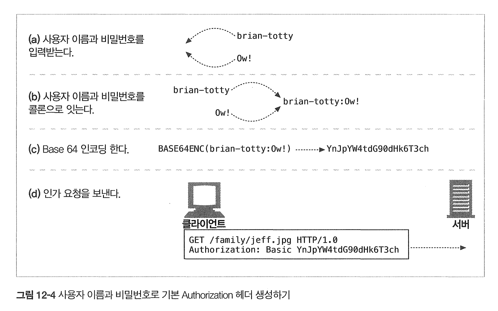

# 12장 기본 인증

### 12.1 인증

1. 다음은 기본 인증에 대한 단계와 해더, 메서드/상태이다. 빈칸을 채우시오.

|   단계   |         헤더        | 메서드 |  상태  |
|:--------:|:-------------------:|:------:|:------:|
|   요청   |                     |   GET  |        |
| 인증요구 |         (A)         |        |   (B)  |
|   인증   |         (C)         |   (D)  |        |
|   성공   | Authentication-Info |        | 200 OK |

2. 위 표에서 언급된 헤더 중 HTTP가 각 리소스마다 다른 접근 조건을 다루게 하는 realm 지시자를 사용하는 헤더는?

 <b> :page_facing_up: 답지 </b>  

1. 다음은 기본 인증에 대한 단계와 해더, 메서드/상태이다. 빈칸을 채우시오.

|   단계   |         헤더         |  메서드 |         상태         |
|:--------:|:--------------------:|:-------:|:--------------------:|
|   요청   |                      |   GET   |                      |
| 인증요구 | **WWW-Authenticate** |         | **401 Unauthorized** |
|   인증   |   **Authorization**  | **GET** |                      |
|   성공   |  Authentication-Info |         |        200 OK        |

> **p.323**

2. 위 표에서 언급된 헤더 중 HTTP가 각 리소스마다 다른 접근 조건을 다루게 하는 realm 지시자를 사용하는 헤더는?
> **WWW-Authenticate**에 realm 지시자를 사용해 인증을 요구할 시 특정 지역 조건을 만족하는 인증을 요구할 수 있다. **p.324**

 

### 12.2 기본 인증

1. 기본 인증 프로토콜을 사용할때 사용하는 해더의 내용 맨 앞에 붙어야 하는 단어는 무엇인가?
> 예시 : `(해더): ___(정답)___ (해더값)`

2. 기본 인증 프로토콜은 `Authentication-Info` 헤더를 사용하지 않는다. ( O / X )

3. 기본 인증 프로토콜에서 사용자 이름과 비밀번호를 Base 64 인코딩할때, 이름과 비밀번호를 각각 인코딩해 콜론으로 이어 인가 요청을 보낸다. ( O / X )

4. 웹 서버를 통해 인증해야 하는 경우 비인증 상태 코드는 `____`이며 프락시 서버를 통해 인증해야 하는 경우 비인증 상태 코드는 `____`이다.

 <b> :page_facing_up: 답지 </b>  

1. 기본 인증을 사용할때 사용하는 해더의 내용 맨 앞에 붙어야 하는 단어는 무엇인가?
> 앞에 **Basic**을 넣어야 한다. `WWW-Authenticate: Basic (realm값)`, `Authorization: Basic (인코딩된 값)`으로 사용된다. **p.326**

2. 기본 인증 프로토콜은 `Authentication-Info` 헤더를 사용하지 않는다. ( **O** / X )
> 당연한 말씀! **p.326**

3. 기본 인증 프로토콜에서 사용자 이름과 비밀번호를 Base 64 인코딩할때, 이름과 비밀번호를 각각 인코딩해 콜론으로 이어 인가 요청을 보낸다. ( O / **X** )

> 인코딩 *이전에* 사용자 이름과 비밀번호를 콜론으로 이어 Base 64 인코딩한다. **p.327**

4. 웹 서버를 통해 인증해야 하는 경우 비인증 상태 코드는 **401 Unauthorized**이며 프락시 서버를 통해 인증해야 하는 경우 비인증 상태 코드는 **407 Proxy Authentication Required**이다.
> **p.328**

 

### 12.3 기본 인증의 보안 결함

다음 중 기본 인증의 보안 결함을 악용한 경우가 아닌 사람을 **모두** 고르세요.

1. 준영이는 Base-64로 인코딩된 지원이의 사용자 이름과 비밀번호를 디코딩하는데 성공했다.
2. 세린이는 지원이가 인증으로 보낸 인코딩된 비밀번호를 가로채 캡처해서 원 서버에 보내는 재전송 공격을 했고, 인증에 성공해 서버에 접근할 수 있었다.
3. 정윤이는 무료 인터넷 이메일 사이트에서 지원이의 사용자이름과 비밀번호 문자열을 그대로 캡처해 동일한 사용자 이름과 비밀번호로 지원이의 은행 사이트에 접근했다.
4. 서진이은 지원이가 사용자 이름과 비밀번호를 입력하는 모습을 뒤에서 몰래 보고 외워 그대로 서버에 접속하는데 성공했다.
5. 성우는 가짜 서버를 만들고 지원이가 서버에 인증을 하도록 위장해 사용자 이름과 비밀번호를 취득했다.

[문제 출처](https://github.com/Kraken-Addicts/HTTP-The-Definitive-Guide/blob/master/3_Identification_Authorization_and_Security/12_Basic_Authentication.md#123--기본-인증의-보안-결함-jehong)

 <b> :page_facing_up: 답지 </b>  

다음 중 기본 인증의 보안 결함을 악용한 경우가 아닌 사람을 고르세요. (중복 가능)

1. 준영이는 Base-64로 인코딩된 지원이의 사용자 이름과 비밀번호를 디코딩하는데 성공했다.
2. 세린이는 지원이가 인증으로 보낸 인코딩된 비밀번호를 가로채 캡처해서 원 서버에 보내는 재전송 공격을 했고, 인증에 성공해 서버에 접근할 수 있었다.
3. 정윤이는 무료 인터넷 이메일 사이트에서 지원이의 사용자이름과 비밀번호 문자열을 그대로 캡처해 동일한 사용자 이름과 비밀번호로 지원이의 은행 사이트에 접근했다.
4. **서진이은 지원이가 사용자 이름과 비밀번호를 입력하는 모습을 뒤에서 몰래 보고 외워 그대로 서버에 접속하는데 성공했다.**
5. 성우는 가짜 서버를 만들고 지원이가 서버에 인증을 하도록 위장해 사용자 이름과 비밀번호를 취득했다.

> 서진이는 그냥 물리적 해킹을 했다...!

 
